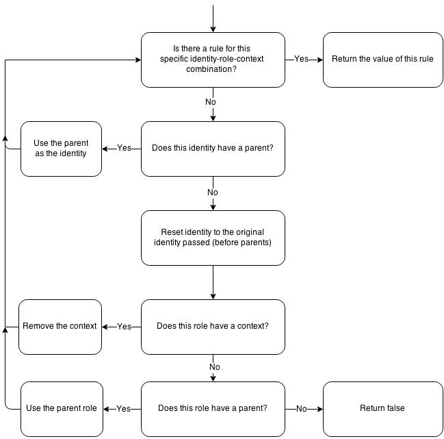

# Judge
Authorization package for PHP.

> Work in progress

## Getting Started

### Roles & Identities

"Roles" are *things* that users of your application can do. These are represented simply as text strings, and are usually things like "EDIT_ORDERS", "VIEW_LOGS", etc.

"Identities" represent the users of your application. Like roles, they are represented as a string. An identity could be some account specific key like an email address or user ID, or it could be something completely different like "console" or "API", or even "anonymous". 

Keeping this mental separation between accounts and identities is key - Judge doesn't have any knowledge of, or care about, accounts or users.

To get started with some basic role-based auth, there is no setup required. Just instantiate `Judge`, and `grant` an an identity access to a role:

```php
$judge = new Judge();

// Grant access to edit orders
$judge->grant('adam@example.com', 'EDIT_ORDERS');
$judge->check('adam@example.com', 'EDIT_ORDERS'); // true

// Revoke access to edit orders
$judge->revoke('adam@example.com', 'EDIT_ORDERS');
$judge->check('adam@example.com', 'EDIT_ORDERS'); // false
```

Simple enough? Good, now let's go a little deeper.

### Role Contexts
Simple role-based permissions suit a lot of use cases, but often you hit their limits quickly when an application starts to grow. Say you have a role for "EDIT_ORDERS" which applies to all orders, but you need a single identity to have access to only edit 1 specific order. How would you do this?

In Judge, the way you would achieve this is by using role "contexts". A role context is a third parameter you can pass to `grant()`, `revoke()` and `check()` to add more specificity to your rule. In practice, a context is usually used for unique identifiers such as an order ID:

```php
$judge->grant('adam@example.com', 'EDIT_ORDERS', '5');
$judge->check('adam@example.com', 'EDIT_ORDERS', '5'); // true
```

The benefit of role contexts is due to their ability to inherit rules. If an rule has not been explicity granted/revoked for the exact role+context combination, then Judge will fallback to check if the identity has been granted/revoked for that role *without* the context:

```php
$judge = new Judge();

// Grant access to edit all orders
$judge->grant('adam@example.com', 'EDIT_ORDERS');

// Override the above, revoking access specifically to order "10"
$judge->revoke('adam@example.com', 'EDIT_ORDERS', '10');

$judge->check('adam@example.com', 'EDIT_ORDERS'); // true
$judge->check('adam@example.com', 'EDIT_ORDERS', '5'); // true
$judge->check('adam@example.com', 'EDIT_ORDERS', '10'); // false
```


### Role Inheritence
Roles & contexts together can solve many auth requirements, but larger systems may need more complex inheritance rules. Here is where we introduce role "parents".

Configuring a role parent looks like this:

```php
$judge->getRepository()->addRole('{ROLE}', '{PARENT_ROLE}');
```

If you call `check()` but the identity has not been explicitly granted or revoked access to the role, but that role has a defined parent, then we fallback to check if a rule exists for the parent:

```php
$judge = new Judge();

// Setup the "EDIT_ORDERS" role with the parent "ORDERS"
$judge->getRepository()->addRole('EDIT_ORDERS', 'ORDERS');

// Grant access to ORDERS and all child roles
$judge->grant('adam@example.com', 'ORDERS');

$judge->check('adam@example', 'EDIT_ORDERS'); // true
```

You can have as many levels in your role parent hierarchy as you like:

```php
$judge = new Judge();

$repo = $judge->getRepository();
$repo->addRole('DELETE_ORDERS', 'CHANGE_ORDERS');
$repo->addRole('CHANGE_ORDERS', 'VIEW_ORDERS');
$repo->addRole('VIEW_ORDERS', 'ORDERS');

// Grant access to ORDERS and all children
$judge->grant('adam@example.com', 'ORDERS');

$judge->check('adam@example', 'EDIT_ORDERS'); // true

// Override the above for access to CHANGE_ORDERS and its children recursively
$judge->revoke('adam@example.com', 'CHANGE_ORDERS');

$judge->check('adam@example', 'ORDERS'); // true
$judge->check('adam@example', 'VIEW_ORDERS'); // true
$judge->check('adam@example', 'CHANGE_ORDERS'); // false
$judge->check('adam@example', 'DELETE_ORDERS'); // false
```

### Identity Inheritence

Identity inheritence works just like role inheritence:

```php
$judge = new Judge();

$repo = $judge->getRepository();
$repo->addIdentity('adam', 'customer_service');

$judge->grant('customer_service', 'EDIT_ORDERS');

$judge->check('adam', 'EDIT_ORDERS'); // true
```

### Putting it all together

Role contexts, role parents, and identity parents all stack, working together to give a truly robust authorisation system.

In order of precidence:

1. Exact match of the identity-role-context combination passed
2. Parent identities with the same role & context
3. The identity + role passed without any context
4. Parent identities with the same role without any context
5. Parent roles with the original identity
6. Parent roles with parent identities 

### Logic Flow



### The Data Structure

Roles:

Role 		| ParentRole
------------|-------------
ORDERS_EDIT | ORDERS_VIEW
ORDERS_VIEW | ORDERS
ORDERS 		| `null`

Identities:

Identity		 | ParentIdentity
-----------------|-------------------
adam			 | customer_service
paul             | customer_service
customer_service | `null`

Rules:

Identity		| Role				| Context	| State
----------------|-------------------|-----------|-----------
adam			| ORDERS_EDIT		| 5			| GRANTED
customer_service| ORDERS			| `null`	| GRANTED
paul			| ORDERS_VIEW		| 5			| REVOKED


## Persistence

The main problem with all of the examples so far is that roles & identities are not persisted across requests - meaning you'd need to reconfigure Judge to understand your identity/role hierarchies, and grant/revoke all the relevant permissions, on every request.

Judge ships with a number of `Judge\Repository\Repository` implementations to persist these relationships:

- `ArrayRepository` : Store data in an array for the duration of this request
- `FlatbaseRepository` : Store to a [flat file database](https://github.com/adamnicholson/flatbase) - no setup required
- `PDORepository` : Store data to a [PDO](http://php.net/manual/en/pdo.drivers.php) compatible DB, like MySQL, SQLite, PostgreSQL

Using a repository:

```php
// PDORepository
$pdo = new PDO('mysql:host=db;dbname=site', 'root');
$repo = new Judge\Repository\PDORepository($pdo);
$judge = new Judge\Judge($repo);

// FlatbaseRepository
$storage = new Flatbase\Storage\Filesystem('/some/storage/path');
$flatbase = new Flatbase\Flatbase($storage);
$repo = new Judge\Repository\FlatbaseRepository($pdo);
$judge = new Judge\Judge($repo);

// ArrayRepository
$judge = new Judge\Judge(new ArrayRepository());
```

> If you do not pass a `Repository` to Judge's constructor, then `ArrayRepository` will be used by default.
